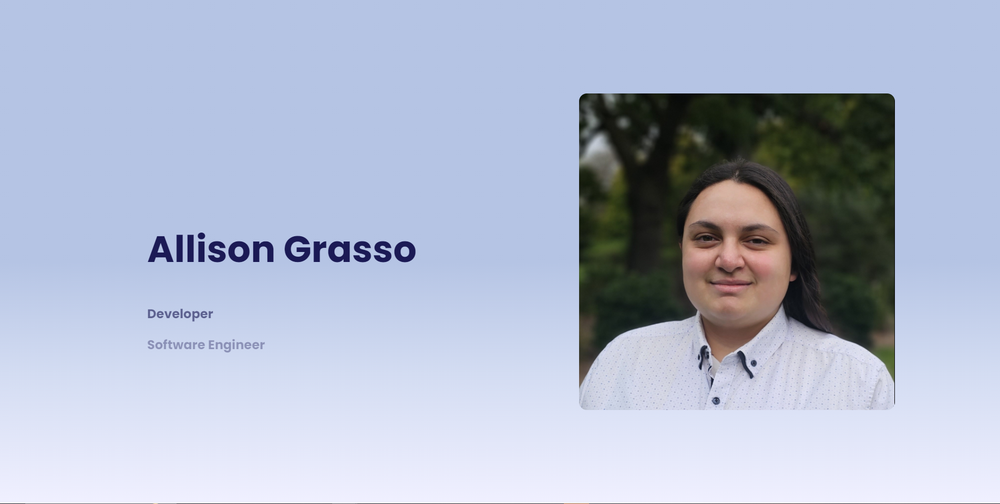

# Welcome to my Portfolio Website

Here is my website that was created using React, Vite, Javascript, and AntDesign. Unfortunately the website is still a work in progress as, for the most part, there are some aspects of the website that are unrelated to the website itself but is crucial to its development.

### Things that are hindering further progress on the website include: 

- Resume
- Suitably Presentable Projects

## Planning

As always I laid out the plans for what my page would look like before I began my work on the site itself.

## Developement

Most of the design of this page was to mimic other portfolio websites that I liked personally, so a lot of time was spent on the CSS of the website.

There was a stalemate on the resume page as the preview image would stretch to fit the window rather than maintain its aspect ratio. This was fixed by the fact I had initialised img width to 100% 

Finally I implemented the dark mode button, efficiently shifting the page between light and dark themes from separate CSS files.

The main issue with the projects being incomplete is the fact they can't effectively be displayed

## Future Improvements

- Fully Functional Projects

        This would be ideal to be able to preview my works in the dedicated previewing section I had left for myself. Of course the complete implementation of the preview section would also be necessary, however that is trivial in comparison to the actual projects themselves.

- Browser Router

        Currently the site utilises a hash router which is perfectly functional, however in terms of overall outlook it would be professional to include a browser router to remove the hash from the url.

- Github Dark Logo

        Originally, depending on what theme the page currently has, would determine what logo would be displayed. Because the usual logo is completely black it would be unideal to use this on dark mode. I am aware that this is possible if I were to use react contexts.

- More Animations

        Some places I'd input animations would be the skills circles so when you hover over them they appear to lift up and move as you move your cursor. I'd also put in the movement between pages so that pages appear to slide between each other.

- Minor Design Changes

        There are a few stylistci choices that could make do with a revamp, all minor and possible to do within an hour, however they require other aspects to be complete before I can fully implement them. The only one that I could dedicate towards currently is the scroll of text on the Hero of the main page. 
        
        Originally the plan was to have them scroll exponentially quickly before slowing to a stop on one of the texts, halting for a few seconds before beginning the cycle again.
