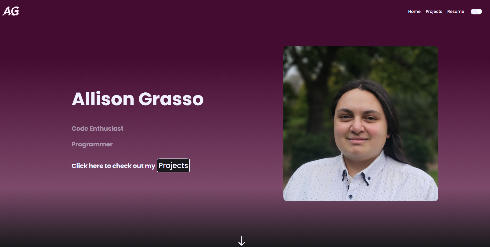

# Welcome to my [Portfolio Website](alligrass.dev)

Thank you for visiting my portfolio website where I showcase the best of my software engineering abilities.

## Tools Used

### React
### Vite
### JavaScript
### CSS
### ANTD - Ant Design UI Framework
### Verticle Timeline - Component

#

## Key Features

Though I'm not specialised in the ways of UI design I've attempted to make the UI of my site as intuitive as possible with considerations to the colour schemes and a simple but effective layout. My portfolio will always be a work in progress as I learn and grow in the industry creating new and exciting pieces and projects. 

### Toggle Dark / Light Mode

Both colour schemes for dark and light mode are done with colourblindness taken into consideration.

### Interactive Project Previews

Any listed projects within my portfolio that are available to preview opens a preview window within the site that is fully interactive to showcase the full capabilities of my projects

### Coding Language Timeline

Using the verticle timeline component I laid out my learning journey from my first website I made in Secondary School up to today highlighting which coding languages were the main languages I'd work with during those years.

## Planning

As is customary for any and all projects I work on, I draft a layout plan for the pages that I will be creating to ensure that when I start building my applications I can streamline straight into functional code. Most of the design choices I'd made for my portfolio mimicked other portfolio websites that I liked personally. UI has never been a concern or specialty of mine, however with this portfolio I strived to make the experience as enjoyable as possible.

## Future Improvements

### Functional

- Scroll to top when switching pages
- Opening Resume in a new browser tab.
- Loading effects to consider slower connections to the site

### More Animations

- Adding animation to the skills display circles so when you hover over them they appear to lift up and move as you move your cursor. 
- Movement between pages so that pages appear to slide between each other.

